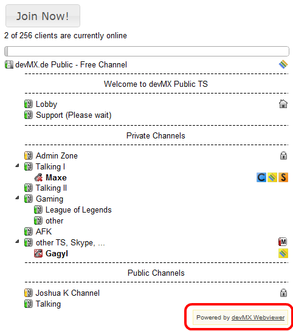
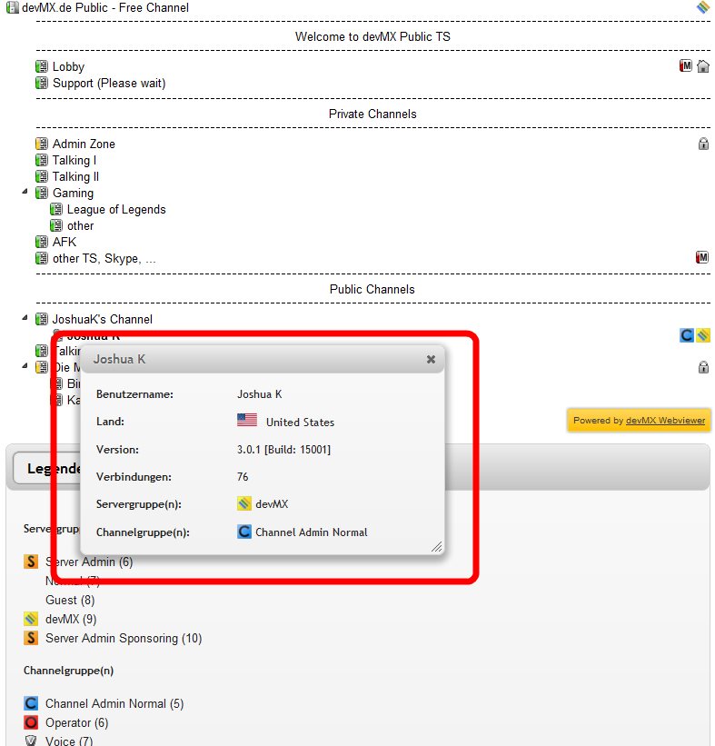
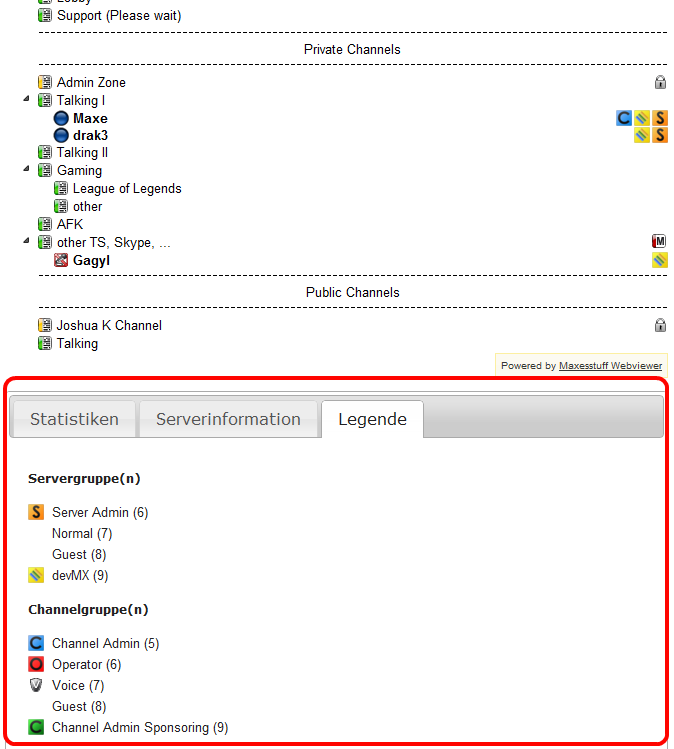
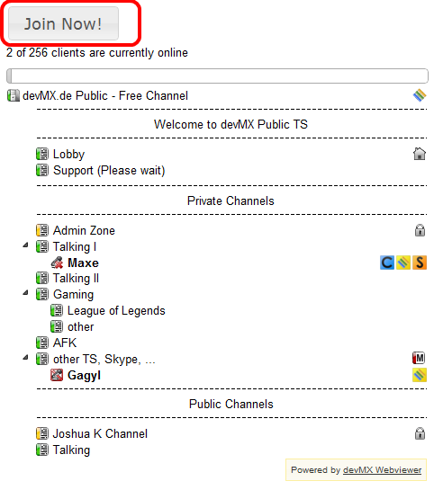
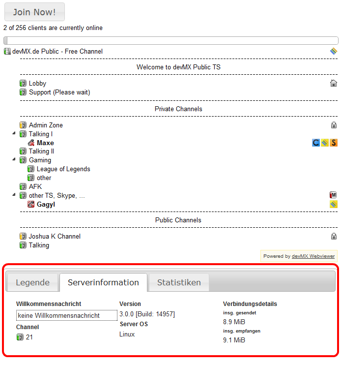
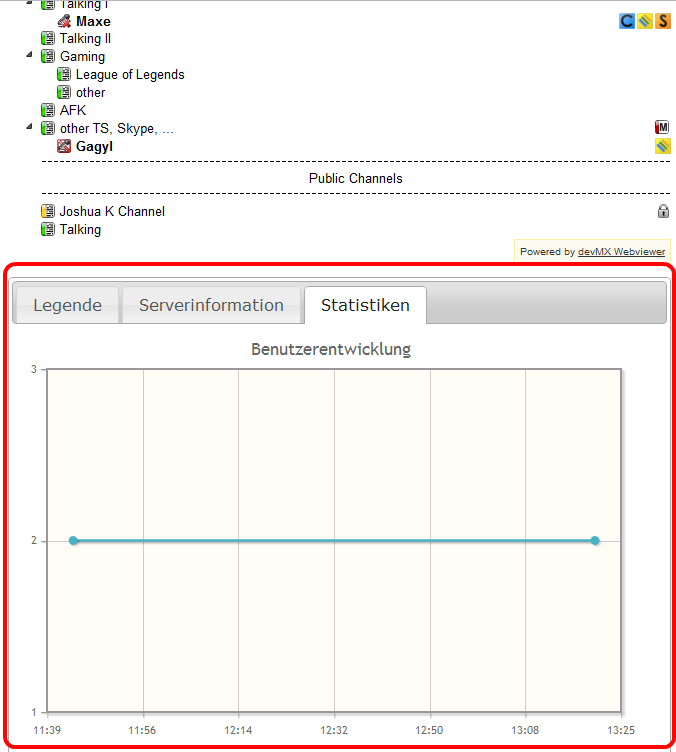
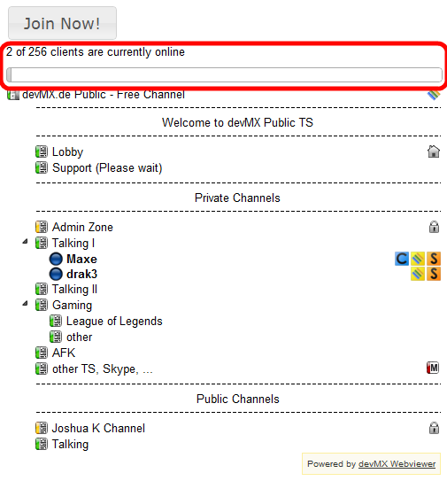

Modules
=======

about
-----

The about module displays a small devMX Banner including a link to devMX.

autoRefresh
-----------

The autoRefesh module refreshes the TeamSpeak3 Webviewer after a specific time.

**Configuration**

refresh_time
    Timme in seconds after which the Webviewer should be reloaded (Default: 60)

channelHiding
-------------

With the help of the channelHiding module you can hide channels and spacers

**Configuration**

fadeIn_time
    How long the fading in of a channel should take (in ms, Default: 400)

fadeOut_time
    How long the fading out of channel should take (in ms, Default: 400)

remember_hidden_chans
    Description
        If hidden channels should be remembered on client side
    Values 
        true, false
    Default
        true

hide_empty_chans
    Description
        If empty channels should be hidden by default. Subchannels are affected as well.
    Values
        true, false
    Default
        false

infoDialog
----------

This module displays a small dialog with information about a client if you hover over it.

**Configuration**

show_html_for_client
    Description
        Comma seperated list of information which should be shown about a client.
    Abvailable information
        nickname, country, version, connections, servergroup, channelgroup, description	nickname,country, version, connections, servergroup, channelgroup, description

close_by_mouseout
    Description
        If the dialog should be automatically closed if the mouse leaves it.
    Values
        true, false
    Default
        true

width
    Description
        Width of the dialog. If none is set, the default value will be used.
    Values
        Pixels, em, %, none
    Default
        none

height
    Description
        Height of the dialog. If none is set, the default value will be used.
    Values
        Pixels, em, %, none
    Default
        none

jsLogin
-------

The jsLogin module adds a link to the servername. If you click on it a dialog will be shown where you can select a username and then connect to the TeamSpeak3 Server.

**Configuration**

prompt_username	
    Description
        If the user should be asked for a username
    Values
        true, false
    Default
        true

prompt_pass
    Description
        If the user should be asked for a serverpassword. Set this to true if the server is password protected.
    Values
        true, false
    Default
        false

server_password
    Description
        You can enter the serverpassword here, so that the user doesn't need to enter it in the dialog. The Password will be automatically added if the user wants to connect to the server.
    Values
        Password, none
    Default
        none

connect_host	
    Description
        If you entered localhost or 127.0.0.1 in the configuration file, specify the external IP-Adress or hostname of your TeamSpeak3 Server here.
    Values
        IP-Adress, Hostname, none
    Default
        none

legend
------

The legend module adds a legend of the server- and channelgroups to the webviewer either via a tab or simply under the viewer.

**Configuration**

use_tab
    Description
        If the legend should be displayed as a tab
    Values
        true, false
    Default
        true

loginButton
-----------

The loginButton module displays a button above the webviewer. By pressing it you can connect directly to the server.

**Configuration**

prompt_username	
    Description
        If the user should be asked for a username
    Values
        true, false
    Default
        true

prompt_pass
    Description
        If the user should be asked for a serverpassword. Set this to true if the server is password protected.
    Values
        true, false
    Default
        false

server_password
    Description
        You can enter the serverpassword here, so that the user doesn't need to enter it in the dialog. The Password will be automatically added if the user wants to connect to the server.
    Values
        Password, none
    Default
        none

connect_host	
    Description
        If you entered localhost or 127.0.0.1 in the configuration file, specify the external IP-Adress or hostname of your TeamSpeak3 Server here.
    Values
        IP-Adress, Hostname, none
    Default
        none

button_text
    Description
        The text which should be displayed on the button
    Default
        Join Now!

serverInfo
----------

The serverInfo module shows information of the server (welcome message, channels, traffic information, version, …) either in a tab or under the webviewer.

**Configuration**

use_tab
    Description
        If the serverInfo should be shown as a tab
    Values
        true, false, none
    Default
        true

value_format
    Description
        The format in which traffic values should be displayed
    Values
    	b, kb, mb, gb, tb, none
    Default
        mb

stats
-----

The stats module includes a diagramm which shows the user history of the server, either as a tab or under the webviewer.

**Configuration**

use_tab	
    Description
        If the stats should be shown as a tab
    Values
        true, false
    Default
        true

height
    Description
        The height of the stats
    Values
	%, em, pixel, none
    Default
        400px

width
    Description
        The width of the stats
    Values
        %, em, px, none	
    Default
        600px

x_formatString	
    Description
        Defines how the labels at the x axes should be formatted. If none, default value will be used.
    Values
        `ref_`, none	
    Default
        %#H:%M	

y_formatString	
    Description
        Defines how the labels at the y axes should be formatted. If none, default value will be used.
    Values
        `ref_`, none
    Default
        %d

l_style	
    Description
        Style of values in the chart. If none, default will be used.
    Values
        diamond, circle, square, x, plus, dash, filledDiamond, filledCircle, filledSquare	
    Default
        filledCircle	

userBar
-------

The userBar module displays a progess bar with the value of current clients online above the viewer.

.. ref_: http://www.jqplot.com/docs/files/plugins/jqplot-dateAxisRenderer-js.html